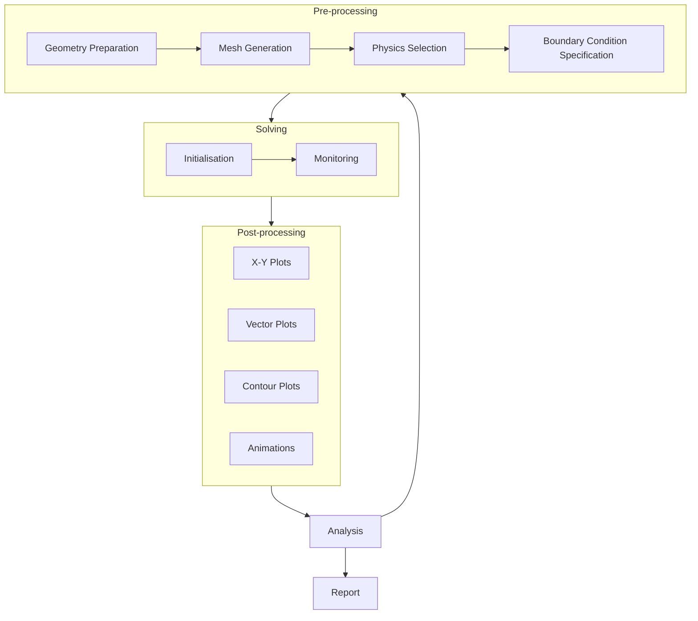
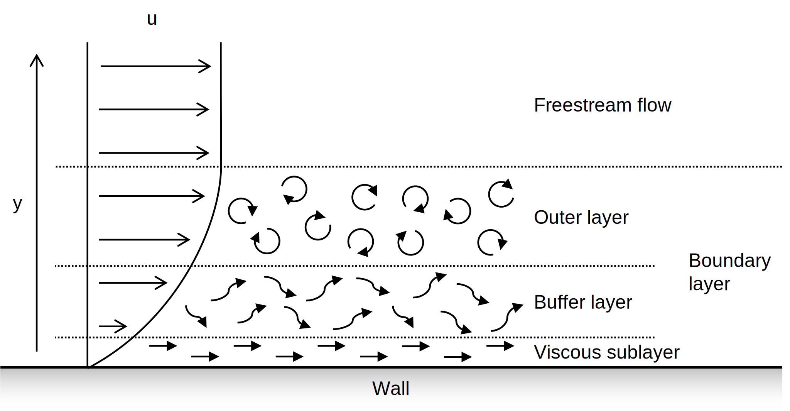
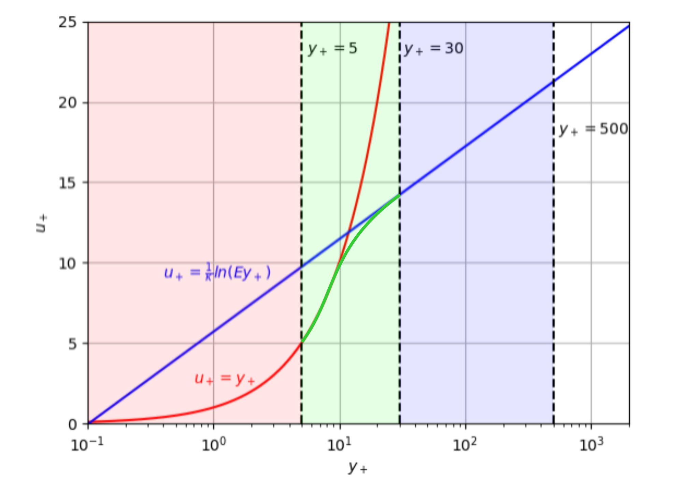

# Computational fluid dynamics

## Introduction

### What is CFD

Computational Fluid Dynamics (CFD) is a fast growing methodology for solving complex problems in engineering where fluids are present within systems.

### Why use CFD

## The CFD Process

The CFD process is rarely completely linear. Often, we prepare geometry, generate our mesh, set up the model, and solve, and then go back to the meshing or pre-processing stage. This can be because the model simply didn't converge, or because we notice something unusual in some initial results, or because we wish to complete a mesh or time-step dependency study. But, after a few loops, we can go on to the final post-processing where we produce images and videos and make judgments on the results.

### Pre-processing

#### Geometry preparation

#### Meshing

#### Physics selection

#### Boundary condition specification

### Solving

#### Initialisation

#### Monitoring

### Post-processing

#### XY plots

#### Vector plots

#### Contour plots

#### Animations

---

## Governing equations

### The Continuity equation

#### Continuity equation derivation

### The momentum equation

#### Momentum equation derivation

### The energy equation

#### Energy equation derivation

---

## Numerical methods

### Finite difference method

### Finite volume method

### Finite element method

---

## Mesh generation

### Types of mesh

### Mesh specification

#### Near-wall sizing

The computations of flow near to any walls needs specific treatment for the model to solve. The flow nearest to the wall moves has a near-zero velocity due to friction between the fluid particles and the wall itself. The velocity increases further from the wall until it reaches the free stream velocity. The layer closest to the wall, where the velocity is below the free stream velocity is referred to as the boundary layer.

The boundary layer itself splits into three other layers: the viscous sublayer, the buffer layer, and the outer layer. The viscous sublayer is the laminar layer nearest to the wall and dominated by the viscous shear stresses between the particles themselves, and their interaction with the wall. The outer layer is a turbulence dominated layer within the boundary layer, and is furthest from the wall. The buffer layer, between the viscous sublayer and turbulent layer, is a blending of the two.

To assess the flow near to the wall several dimensionless terms are used. The most important of these is $y_{+}$. The $y_{+}$ is a dimensionless distance from the wall which could be interpreted as being a local Reynolds Number, in that it determines the relative importance of viscous and turbulent flows.

$$ y_{+} = \dfrac{y u_{\tau}}{\nu}$$

The $y_{+}$ is a function of the absolute wall distance, $y$, the fluid's kinematic viscosity, $\nu$, and the friction velocity, $u_{\tau}$. The friction velocity is a form of shear stress, written in terms of the flow velocity.

$$ u_{\tau} = \sqrt{\dfrac{\tau_{w}}{\rho}} $$

The friction velocity is a function of the fluid's density, $\rho$, and the wall shear stress, $\tau_{w}$. The wall shear stress is determined by:

$$ \tau_{w} = \rho \nu \dfrac{du}{dy}$$

Wall chear stress is dependent on the fluid properties, specifically kinematic viscosity and density, and the the change in velocity at a given change in distance from the wall, $\dfrac{du}{dy}$.

An additional dimensionless quantity, dimensionless velocity, $u_{+}$, can be obtained from the above, and the fluid velocity, $u$.

$$ u_{+} = \dfrac{u}{u_{\tau}}$$

By comparing the $u_{+}$ and $y_{+}$ values within the boundary layer, fu

Within the viscous sublayer the shear stress is approximately constant and equivalent to the wall shear stress. This means that the dimensionless values $u_{+}$ and $y_{+}$ can be considered equal to one another (Reference 1, Equation 7.8). This is true when $u_{+}$ and $y_{+}$, constituting the viscous sublayer.

$$u_{+} = y_{+}$$

However, when turbulent effects become more dominant, such as in the outer layer, a logarithmic equation is used to account for the relationship between $u_{+}$ and $y_{+}$ (Reference 1, Equation 7.9). This holds true for $30 < y_{+} < 500$.

$$u_{+} = \dfrac{1}{\kappa} ln(E y_{+})$$

In the above equation, the Von Karman constant, $\kappa$, is typically 0.4 and the roughness parameter, $E$, is 9.8.  By plotting the two equations we can see that the two equations overlap where $y_{+}$ is approximately equal to 11.

##### Calculating a near wall cell size

#### Free-flow sizing

##### Calculating a free flow cell size

### Assessing mesh quality

---

## Advanced topics

### Compressibility

### Turbulence

### Multiphase

### Heat transfer
