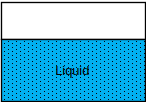
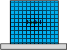

# Fluid mechanics

## Fundamentals

### Definition of a fluid

Fluids are not able to resist shear stress and deform under it as molecules are not attached and are free to move

Gasses and liquids are both fluids, solids, typically, are not

The differing characteristics are largely due to molecular structure

#### Gasses

Gasses take both the shape and volume of their container

They have widely spaced molecules with weak cohesive forces

Molecular movement is very high

Properties are easily affected by changes in temperature and pressure

Easily compressible due to high molecule spacing

They have no free surface and are not dominated by gravity, except in buoyancy

#### Liquids

Liquids take the shape of their container, but not its volume

They have closely packed molecules with strong cohesive forces

Molecules are relatively free to move

They create a free surface and are dominated by gravity

Properties vary only slightly with changes in temperature and pressure

Not easily compressed; often considered incompressible

#### Solids

Solids are able to resist shear stress by static deflection

The spacing between molecules is generally very low

The individual molecular movement is very low

They are made up of structured and rigidly attached molecules

### Fluid continuum

Fluid is treated as a continuum for calculation purposes, instead of modelling individual behaviour of molecules, and average conditions assumed

This is accurate, except when the number of molecules is low and the spacing between them is great (i.e. gasses at very low pressures)

### Dimensions and units

There are four primary dimensions in fluid mechanics:

1. Mass (kg)
2. Length (m)
3. Time (s)
4. Temperature (K)

All other dimensions used in fluid mechanics can be derived from these

All equations must be dimensionally homogeneous - each additive must have the same dimension

All equations must have consistent units - each additive must have the same units

### Fluid properties

The following properties help to define all fluids:

#### Density

Density, $\rho$, is ratio of the amount of mass, $m$, a substance has to its volume, $V$, measured in $\frac{kg}{m^3}$

$$
\rho = \dfrac{m}{V}
$$

#### Pressure

A ratio of the pressure that a fluid exerts on a given surface to the area of that surface, measured in $\frac{N}{m^2} = Pa = 10^{-5} bar$

$$
p = \dfrac{F}{A}
$$

All fluids have pressure

Gauge pressure is set such that at sea level, a gauge will read zero

Absolute pressure, on the other hand, includes the pressure of the atmosphere, such that at sea level, absolute pressure is approximately 101325Pa

#### Static pressure

Static pressure is the pressure that a fluid is at when nothing is moving and it is at rest, generated by the depth, $h$, of the fluid and gravity, $g$

$$
p_s=\rho gh
$$

#### Dynamic pressure

Dynamic pressure is pressure within a fluid which is generated by the velocity, $u$, of either the fluid or a surface

$$
p_d = \dfrac{1}{2}\rho v^2
$$

#### Total pressure

Total pressure is the sum of those pressures

$$
p_t=p_s+p_d
$$

#### Temperature

Temperature, $T$, relates to the average kinetic energy of atoms and molecules in a system, measured in $\degree C=273.15K$

At absolute 0, there is no molecular motion and so this is the lowest possible temperature

#### Viscosity

A fluid property responsible for a fluid's resistance to shear stresses

There are two types of viscosity

##### Dynamic

Derived from a proportionality constant of shear stress, $\tau$, with velocity gradient, $\frac{du}{dy}$, measured in $Pa s = \frac{N s}{m^2} = \frac{kg}{m s}$

$$
\mu = \dfrac{\tau}{\frac{du}{dy}}
$$

Dynamic viscosity is proportional to the inertial forces

##### Kinematic

Kinematic viscosity, $\nu$, is related to the dynamic viscosity, $\mu$, by the fluid density, $\rho$, measured in $\frac{m^2}{s}$

$$
\nu = \dfrac{\mu}{\rho}
$$

Kinematic viscosity is proportional to the viscous forces

#### Surface tension

Surface tension, $\gamma$, is the result of different forces between molecules of two adjacent substances, often a liquid and a gas, measured in $\frac{N}{m}$

It is half the ratio of the force, $F$, holding a fluid in place, to the length of the surface, $L$

$$
\gamma = \dfrac{1}{2} \dfrac{F}{L}
$$

A droplet of liquid free of all other forces is exactly spherical due to surface tension

Forces between molecules of a liquid are bound to each other, and so they are cohesive, this is why liquids tend to remain as one body, rather than filling their volume as gasses do

Forces between the molecules of a liquid and its solid boundary give rise to adhesion, and so the liquid will spread across the surface, increasing the contact area

#### Compressible fluids

In addition to those listed above, the following properties are additionally considered for calculations where a fluid is thought to be compressible

##### Bulk modulus

The bulk modulus, $B$, is used to define how much a system compresses, measured in $Pa$

It relates a change in pressure, $dp$, to the change in volume, $dV$

$$
B = -V\dfrac{dp}{dV}
$$

##### Compressiblity

Compressibility, $K$, is the inverse of bulk modulus, measured in $\frac{1}{Pa}$

$$
K = \dfrac{1}{B}
$$

##### Mach number

The Mach number, $M$, of a fluid is a ratio of the fluid speed, $u$, to the speed of sound, $a$, in that fluid

$$
M = \dfrac{u}{a}
$$

When the Mach number is above 0.3, a fluid is generally considered compressible

Typically, liquids are modelled as incompressible, but gasses are more easily compressed and so usually require compressibility calculation

##### Equations of state

Equations of state are used to relate the pressure, $p$, mass, $m$, volume, $V$, and temperature, $T$, of a gas

Gasses have a gas constant, $R$, which helps to define the gas

For a perfect gas, the equation of state is:

$$
pV=mRT
$$

Or:

$$
p=\rho RT
$$

### Flow classification

The following classifications exist to enable selection of appropriate calculations

#### Internal and external flows

Internal flows are flows between bounding surfaces, such as in pipework

External flows are flows where a body is surrounded by a fluid, such as flow over an aircraft wing

#### Laminar and turbulent flows

Laminar flow tends to flow in straight lines, with no mixing

Turbulent flow, on the other hand, fluctuates in direction, causing mixing within the fluid

#### Steady and unsteady flows

Steady flows are those which are not considered to change over time; the fluid properties at a set point remain constant

Unsteady flows, on the other hand, is time dependent, otherwise known as transient, and the fluid properties at a given location will change over time

#### Compressible and incompressible flows

Compressible flows are those where the compressibility of the fluid is significant, typically when the Mach number is above 0.3

Incompressible flows are unrealistic, but can be assumed when the Mach number is low

### Frames of reference

There are two typical frames of reference for fluid mechanics:

1. Lagrangian focusses on pressure changes that a single particle experiences through space and time
2. Eularian focusses on calculating the whole pressure fields of the flow pattern

Eularian is generally most suited to fluid mechanics calculations

## Hydrostatics

### Variation of pressure and position

### Pressure measurement

### First and second moments of area

### Thrust

### Buoyancy

### Stability

### Equilibrium

## Hydrodynamics

### Fluid particle acceleration

### Continuity equation

### Bernoulli equation

### Energy equation

### Pressure variation

## Internal pipes and fittings

## Boundary layers

## Free surface flow

## Compressible flow

## Unsteady flow
